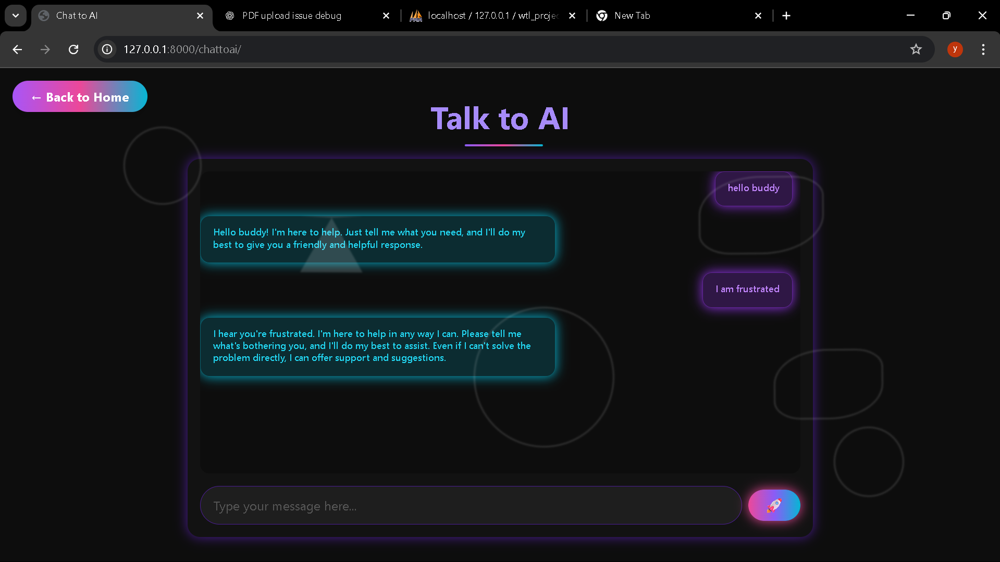
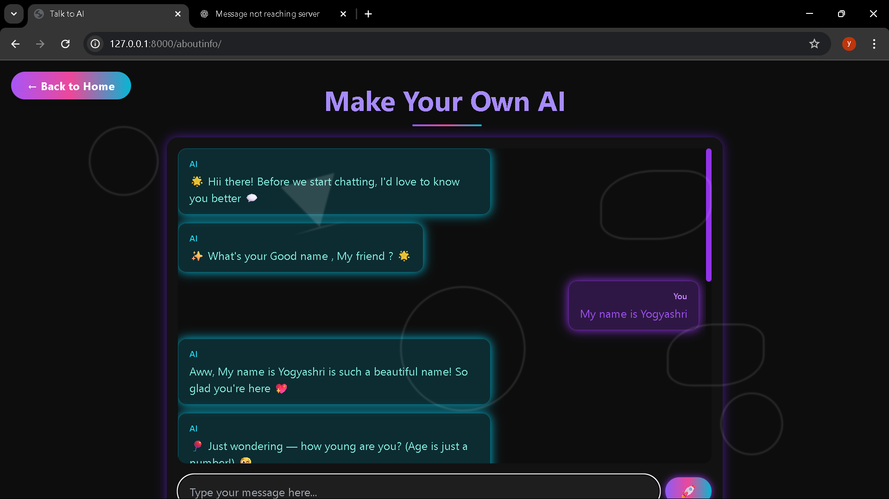

# 🤖 Buddy AI — Your Personalized AI Companion

**| Work As A Frontend Developer 💻✨ |**

---
**Buddy AI** is a smart, flexible, and user-friendly AI companion built to empower users with modern AI capabilities — all in one sleek interface. Whether you're chatting with AI, creating your own custom assistant, or uploading a PDF for intelligent Q\&A, Buddy AI delivers a seamless experience.It is a smart and flexible AI assistant built with modern technologies. It offers a seamless way to interact with AI in three powerful modes:

---

## 🔹 Features

### 1. 💬 Chat with AI  
Simple and intuitive AI chat for instant conversations.

---

### 2. 🛠️ Build Your Own AI  
Train your own assistant using custom content you provide.

  

---

### 3. 📄 Chat with PDF (RAG)  
Upload a PDF and ask questions — powered by Retrieval-Augmented Generation.

---

## 🧰 Tech Stack

- **Frontend:** HTML, Tailwind CSS, JavaScript  
- **Backend:** Django  
- **AI Integration:** RAG (Retrieval-Augmented Generation), Custom AI Models

---

## 📱 Connect with Me  
🐦 LinkdIn: [@RoshniPatil](https://www.linkedin.com/in/roshni-patil-04881528b/)
